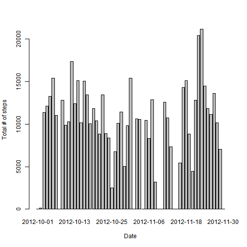
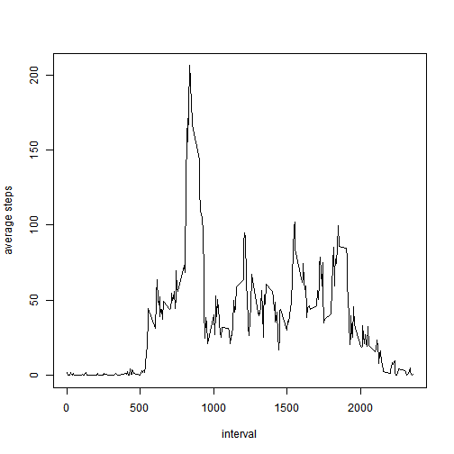
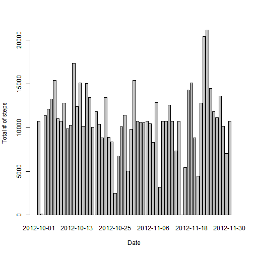

### 1. Loading and preprocessing the data

```r
DF <- read.csv('activity.csv')

library(tidyverse)
DF <- DF %>%
	select(date, interval, steps)
```

### 2. What is the mean total number of steps taken per day?  

```r
totalperday <- tapply(DF$steps, DF$date, sum, na.rm = TRUE)
barplot(totalperday, xlab='Date', ylab='Total # of steps')
```



Mean = 9354.2295082  
Median = 10395

### 3. What is the average daily activity pattern?

```r
dailyactivity <-  tapply(DF$steps, DF$interval, mean, na.rm=TRUE)
plot(names(dailyactivity), dailyactivity, type='l', xlab='interval', ylab='average steps')
```



Interval with maximum average = `` 835 ``

### 4. Imputing missing values

```r
sum(is.na(DF))
```

```
## [1] 2304
```

```r
newDF <- DF
for (i in 1:nrow(DF)) {
	if(is.na(newDF[i,]$steps)) {
		newDF[i,]$steps <- dailyactivity[[as.character(DF[i,]$interval)]]
	}
}
newtotalperday <- tapply(newDF$steps, newDF$date, sum, na.rm = TRUE)
barplot(newtotalperday, xlab='Date', ylab='Total # of steps')
```



new Mean = 1.0766189 &times; 10<sup>4</sup> ( > 9354.2295082)

new Median = 1.0766189 &times; 10<sup>4</sup>( > 10395)


### 5. Are there differences in activity patterns between weekdays and weekends?

```r
D <- newDF %>%
	mutate(dayend = ifelse(weekdays(as.Date(as.character(date), '%Y-%m-%d')) %in% c('<U+653C><U+3E64>넗<U+653C><U+3E63>슂<U+653C><U+3E63>씪', '<U+653C><U+3E63>씪<U+653C><U+3E63>슂<U+653C><U+3E63>씪'), 'weekend', 'weekday')) %>%
	mutate(dayend = as.factor(dayend)) %>%
	group_by(interval, dayend) %>%
	summarise(
		avg = mean(steps)
	)

ggplot(data = D) +
	geom_line(aes(interval, avg, col=dayend)) +
	facet_grid( dayend ~ . ) +
	ggtitle('Average steps across all weekday / weekend days')
```

```
## Error: 구문분석중 라인 2에서 유효하지 않은 멀티바이트 문자를 찾았습니다
```


